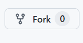
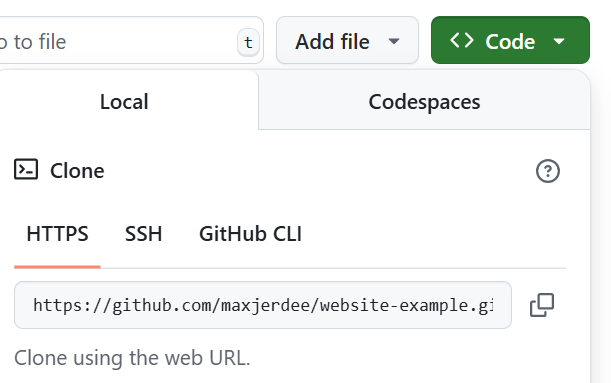
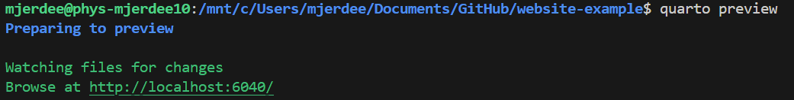
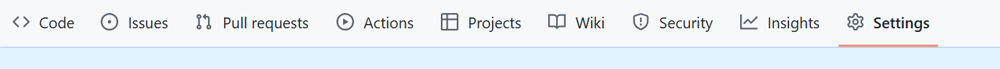
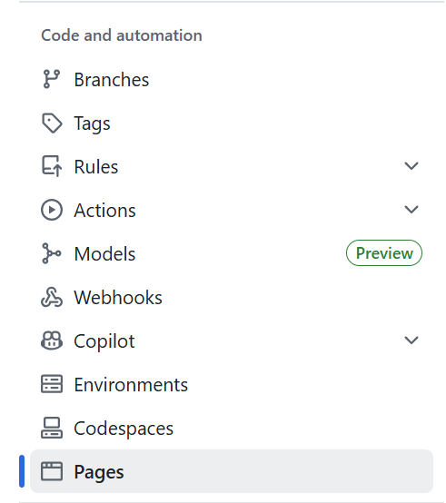
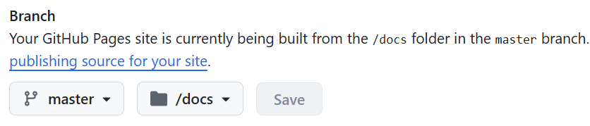
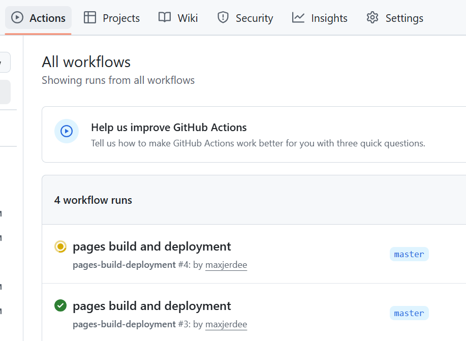
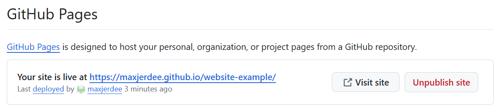
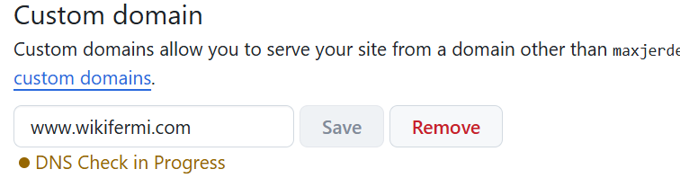
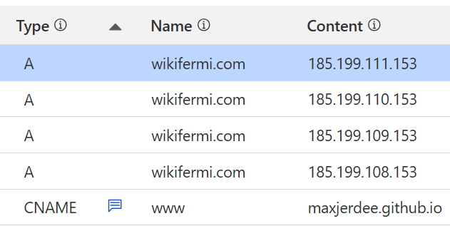

## Example website

This is a template for developing your own personal academic website using the [quarto framework](https://quarto.org/).

After following these steps you should have a basic website that looks [like this](https://maxjerdee.github.io/website-example/) which you can then further customize and expand. 

### Prerequisites

Before you begin, ensure you have met the following requirements:

- You have a [GitHub account](https://github.com/join).
    Test this by signing in to your account [here](https://github.com/login).
- You have [Git](https://git-scm.com/) installed on your computer.
    Test this by opening your terminal and running `git --version`. You should also be able to push and pull files between your local machine and GitHub, either on the command line using SSH or with a tool like GitHub desktop.
- You have [Quarto](https://quarto.org/docs/get-started/) installed on your computer.
    Test this by opening your terminal and running `quarto --version`.

### Steps

1. Fork this repository to make a version of this code on your own GitHub account.


- Note that at this stage you can rename the repository it to something like "personal-website" although this will slightly change the following commands. If you do not have GitHub Pro, you will need to keep the repository public. 

2. Clone the repository onto your local machine.
- Open your terminal and run `git clone https://github.com/YOUR_USERNAME/website-example.git` to download a coppy of your forked repository. This URL should match what is found from the green "Code" button on your forked repository page. (Alternatively use GitHub desktop for this step)


- Navigate into the repository folder run `cd website-example` in the terminal.

3. Locally check the website.
- Run `quarto preview` inside the `website-example` directory to render the website locally. This will open a browser window with the website, which you can edit and refresh to see changes. You maybe need to manually copy the given link, which will look like `http://localhost:6040` (numbers will be randomized). Keep this terminal window open while you work on the website, when changes are made they will update in real-time.



4. Customize the website content in any text editor (VS code is convenient)
 - Edit the `index.qmd` file to include your own name, short description, and other personal information. 
 - Edit the `papers.qmd` to reflect your publications or preprints (can also delete this tab by changing the `_quarto.yml` file)
 - Edit `research.qmd` to include your research interests and projects.
 - Change `assets/CV.pdf` to a pdf of your own CV. 
 - Play around with the overall theme and layout by changing the `template: solana` in `index.qmd` and `theme: cosmo` in `_quarto.yml` to different options.

5. Push your edits to your GitHub repository.
- Open your terminal and run `git add .` to stage your changes.
- Run `git commit -m "Update website content"` to commit your changes.
- Run `git push` to push your changes to your GitHub repository. (May need to enter credentials)
- (This can also be done using GitHub desktop).

6. Host using GitHub pages
- Click on Settings


- Click on Pages


- Select the "master" branch, then the "docs" folder, and click "Save" to tell GitHub where the HTML files can be found


- Can check the "Actions" tab to see the job where GitHub renders the Quarto markdown files into HTML. Once the deployment is complete a green checkmark will appear (typically less than a minute)


- After the website has been rendered, back on the Pages tab we can find a link to the website


7. (Optional) Host on a custom domain. 
- Check that your desired domain name is available, and purchase it from a DNS registrar. (For example [Cloudflare](https://www.cloudflare.com/products/registrar/).)

- Enter the domain into the Settings > Pages tab 


- In the DNS settings of your domain registrar, create a CNAME record that points to `YOUR_USERNAME.github.io`

- In order for your apex domain (e.g. yourdomain.com) to work, you will need to create four A records that point to the IP addresses `185.199.108.153`, `185.199.109.153`, `185.199.110.153`, and `185.199.111.153`. Your overall records under "DNS settings" should look like this (in this example the GitHub account `maxjerdee` is using the custom domain `wikifermi.com`):


8. (Optional) Delete the `README_images` folder from your forked repository and edit this README, these are just instructions to get started. Can replace the `README.md` with something like:

```
## Your Name's personal website

Hosted at [yourdomain.com](https://www.yourdomain.com/)

Built with the [quarto framework](https://quarto.org/)
```
